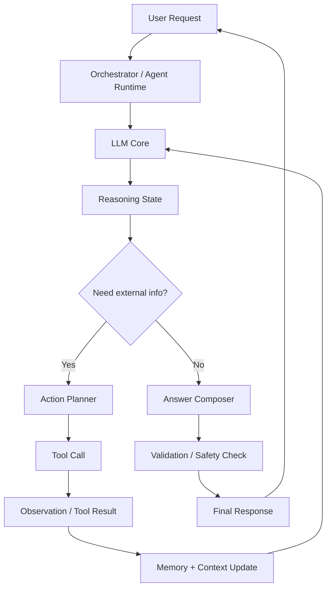

# Agents Under The Hood

This repository explains how **Reasoning and Acting (ReAct) Agents** work internally.
ReAct combines:

- **Reasoning**: The model thinks about what to do next.
- **Acting**: The model calls tools (search, calculator, code runner, APIs, etc.) to get missing information.

The agent repeats this pattern in loops until it has enough evidence to produce a final answer.

## What Is a ReAct Agent?

A ReAct agent is a control loop around an LLM:

1. Understand the user goal.
2. Think step-by-step (internal reasoning).
3. Decide whether to call a tool.
4. Observe the tool output.
5. Update the plan.
6. Repeat until ready to answer.

This improves reliability because the model does not guess when it can verify with tools.

## Architecture Diagram



## Diagram Explanation

- `User Request`: The problem statement from the user.
- `Orchestrator / Agent Runtime`: Controls the loop and decides when to continue or stop.
- `LLM Core`: Generates thoughts, actions, and responses.
- `Reasoning State`: Tracks current hypothesis, missing facts, and next step.
- `Need external info?`: Decision gate. If knowledge is missing, use tools.
- `Action Planner`: Chooses the best tool and input.
- `Tool Call`: Executes API/query/code/tool action.
- `Observation / Tool Result`: Captures returned data.
- `Memory + Context Update`: Adds trusted observations back into context.
- `Answer Composer`: Builds the final user-facing answer from verified info.
- `Validation / Safety Check`: Ensures quality, policy, and format correctness.

## ReAct Loops

### Loop1: Reasoning Loop (Think -> Decide)

Purpose: decide what is missing and whether action is required.

Typical steps:

1. Parse intent and constraints.
2. Generate a short plan.
3. Identify unknowns.
4. Decide: answer now or gather data.

Output of Loop1:

- Either a direct answer draft, or
- A structured action request for Loop2.

### Loop2: Acting Loop (Act -> Observe -> Update)

Purpose: resolve unknowns via tools.

Typical steps:

1. Select tool (`search`, `db`, `calculator`, `code`, etc.).
2. Execute with precise inputs.
3. Capture observation.
4. Evaluate if observation is enough.
5. If not enough, act again.
6. Send updated context back to Loop1.

Key idea: each action should reduce uncertainty.

### Answer Loop (Anwer Loop): Compose -> Verify -> Deliver

Purpose: produce the final response once confidence is high.

Typical steps:

1. Compose answer using verified observations.
2. Check correctness, clarity, and safety.
3. Ensure response matches user format/style needs.
4. Return final answer.

> Note: "Anwer loop" is commonly intended as "Answer loop".

## End-to-End Flow Summary

1. User asks a question.
2. **Loop1** reasons about what is needed.
3. If needed, **Loop2** gathers evidence using tools.
4. Agent cycles between Loop1 and Loop2 until ready.
5. **Answer loop** formats and validates the final response.

## Why ReAct Works Well

- Reduces hallucination by grounding answers in tool output.
- Improves traceability (you can inspect steps).
- Handles complex tasks through iterative decomposition.
- Supports dynamic planning when new information appears.

## Minimal Pseudocode

```text
state = init(user_query)

while not state.ready_to_answer:
	thought = reason(state)                  # Loop1
	if thought.requires_action:
		obs = act_and_observe(thought)       # Loop2
		state = update(state, obs)
	else:
		state.ready_to_answer = True

final_answer = compose_and_validate(state)   # Answer loop
return final_answer
```

## uv Quickstart Commands

`uv` is a fast Python package and project manager. Use it to initialize projects, manage dependencies, and run code.

### Project setup

```bash
# Initialize a new Python project in the current directory
uv init

# Initialize with a specific project name
uv init my_project
```

### Dependency management

```bash
# Add a runtime dependency
uv add requests

# Add multiple dependencies
uv add fastapi pydantic

# Add a development dependency
uv add --dev pytest ruff

# Remove a dependency
uv remove requests
```

### Run and execute

```bash
# Run a Python file using the project environment
uv run main.py

# Run a module
uv run -m pytest

# Run a command-line tool from dependencies
uv run ruff check .
```

### Environment and sync

```bash
# Create/update environment from lockfile
uv sync

# Rebuild lockfile from pyproject.toml
uv lock

# Show dependency tree
uv tree
```

### Python version management

```bash
# Pin a Python version for the project
uv python pin 3.12

# Install a Python version
uv python install 3.12
```

### Useful workflow

```bash
uv init
uv add openai
uv add --dev pytest
uv run python -c "print('ReAct agent project ready')"
```

## Manual JSON Schemas

When calling an LLM with tool-use support (such as Ollama or the OpenAI-compatible API), the model needs a precise description of each tool in a structured format. This description is the **JSON schema**, and it tells the model:

- What the tool is called (`name`)
- What it does (`description`)
- What inputs it accepts (`parameters`) — their names, types, and whether they are required

### Schema Structure

Each tool entry follows this shape:

```json
{
  "type": "function",
  "function": {
    "name": "<function_name>",
    "description": "<what the function does>",
    "parameters": {
      "type": "object",
      "properties": {
        "<param_name>": {
          "type": "<json_type>",
          "description": "<what the param means>"
        }
      },
      "required": ["<param_name>"]
    }
  }
}
```

### Example from This Project

```python
tools_for_llm = [
    {
        "type": "function",
        "function": {
            "name": "get_product_price",
            "description": "Look up the price of a product in the catalog.",
            "parameters": {
                "type": "object",
                "properties": {
                    "product": {
                        "type": "string",
                        "description": "The product name, e.g. 'laptop', 'headphones', 'keyboard'",
                    },
                },
                "required": ["product"],
            },
        },
    },
    {
        "type": "function",
        "function": {
            "name": "apply_discount",
            "description": "Apply a discount tier to a price and return the final price. Available tiers: bronze, silver, gold.",
            "parameters": {
                "type": "object",
                "properties": {
                    "price": {"type": "number", "description": "The original price"},
                    "discount_tier": {
                        "type": "string",
                        "description": "The discount tier: 'bronze', 'silver', or 'gold'",
                    },
                },
                "required": ["price", "discount_tier"],
            },
        },
    },
]
```

These schemas are passed directly to `ollama.chat(model=MODEL, tools=tools_for_llm, messages=messages)`. The LLM reads them at inference time to decide which tool to call and with what arguments.

### Ollama Auto-Schema Shortcut

Ollama can also generate schemas automatically if you pass the Python functions directly:

```python
tools_for_llm = [get_product_price, apply_discount]
```

This requires **Google-style docstrings** with an `Args:` section so Ollama can parse parameter descriptions:

```python
def get_product_price(product: str) -> float:
    """Look up the price of a product in the catalog.

    Args:
        product: The product name, e.g. 'laptop', 'headphones', 'keyboard'.

    Returns:
        The price of the product, or 0 if not found.
    """
```

The manual JSON version is kept in this project to make the hidden machinery visible.

### When to Write Schemas Manually

| Situation | Recommendation |
|---|---|
| Learning how tool-calling works | Manual — see exactly what the LLM receives |
| Docstrings don't follow Google format | Manual — full control over descriptions |
| Using a framework that auto-generates them | Auto (LangChain `@tool`, Ollama direct functions) |
| Complex nested parameter types | Manual — auto-generation may miss nuance |
| Production code with many tools | Auto + validation to reduce boilerplate |

---

## Manual JSON Schemas vs LangChain Tool Abstraction

This project deliberately avoids LangChain to expose the low-level mechanics. The table below maps each manual step to its LangChain equivalent.

| Step | Manual (this project) | LangChain Abstraction |
|---|---|---|
| **Schema definition** | Hand-written `tools_for_llm` JSON dict | `@tool` decorator auto-generates from type hints + docstring |
| **Binding tools to LLM** | Pass `tools=tools_for_llm` to `ollama.chat()` | `llm.bind_tools([get_product_price, apply_discount])` |
| **Invoking the LLM** | `ollama.chat(model=MODEL, tools=..., messages=...)` | `llm_with_tools.invoke(messages)` |
| **Reading tool name** | `tool_call.function.name` (attribute access on Ollama object) | `tool_call.get("name")` (dict access on LangChain `ToolCall`) |
| **Reading tool args** | `tool_call.function.arguments` | `tool_call.get("args")` |
| **Executing the tool** | `tool_to_use(**tool_args)` (direct Python call) | `tool.invoke(tool_args)` |
| **Tracing / observability** | Manual `@traceable` on every function | LangChain callbacks + LangSmith auto-instrumentation |
| **Tool registry** | Plain `dict` mapping name → function | `ToolExecutor` or `tool_node` in LangGraph |

### Code Comparison

#### Schema definition

```python
# Manual
tools_for_llm = [
    {
        "type": "function",
        "function": {
            "name": "get_product_price",
            "description": "Look up the price of a product in the catalog.",
            "parameters": {
                "type": "object",
                "properties": {
                    "product": {"type": "string", "description": "..."},
                },
                "required": ["product"],
            },
        },
    }
]

# LangChain
from langchain_core.tools import tool

@tool
def get_product_price(product: str) -> float:
    """Look up the price of a product in the catalog."""
    ...
```

#### Binding and invoking

```python
# Manual
response = ollama.chat(model=MODEL, tools=tools_for_llm, messages=messages)

# LangChain
llm_with_tools = llm.bind_tools([get_product_price, apply_discount])
response = llm_with_tools.invoke(messages)
```

#### Executing the selected tool

```python
# Manual
tool_name = tool_call.function.name
tool_args = tool_call.function.arguments
observation = tools_dict[tool_name](**tool_args)

# LangChain
tool_name = tool_call.get("name")
tool_args = tool_call.get("args")
observation = tools_dict[tool_name].invoke(tool_args)
```

### Key Takeaways

- **Manual schemas** give full visibility but require more boilerplate. Every parameter description must be written by hand.
- **LangChain `@tool`** reduces ceremony and keeps the schema co-located with the implementation, but hides what the LLM actually receives.
- Both approaches produce functionally equivalent behaviour — the LLM sees the same JSON either way.
- For learning or debugging, the manual approach is invaluable. For production systems with many tools, the abstraction layer saves significant effort.