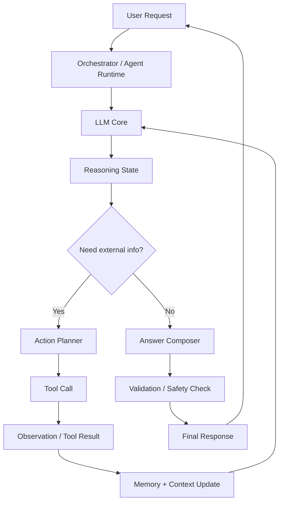
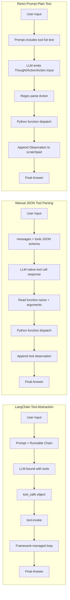
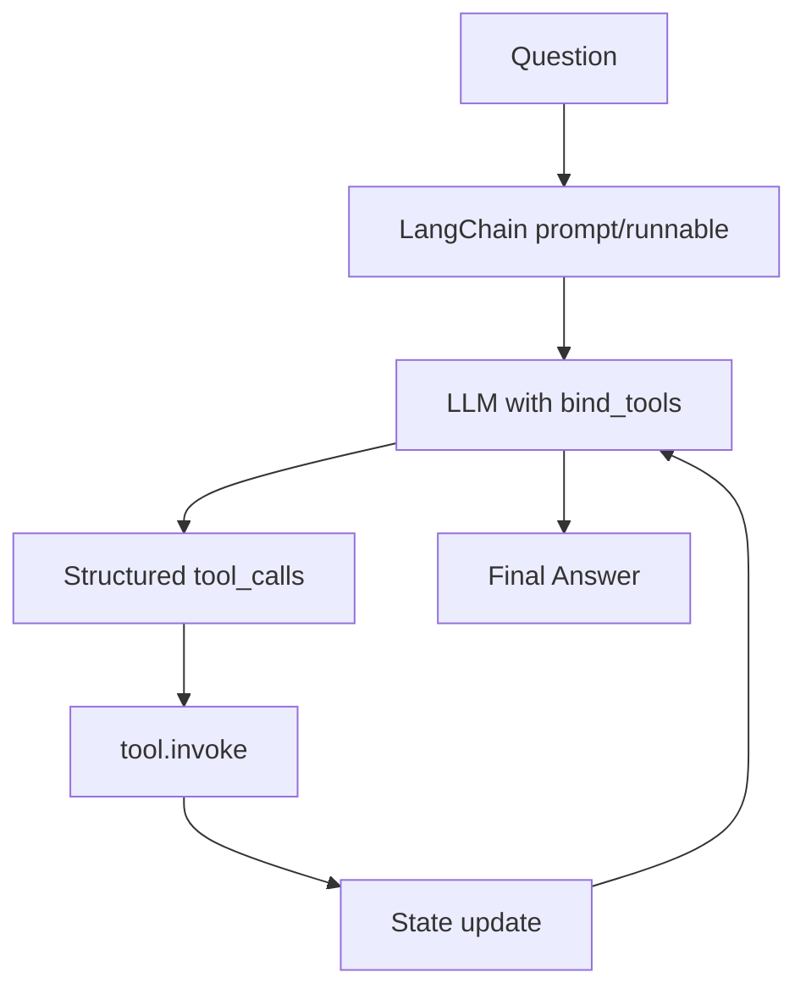
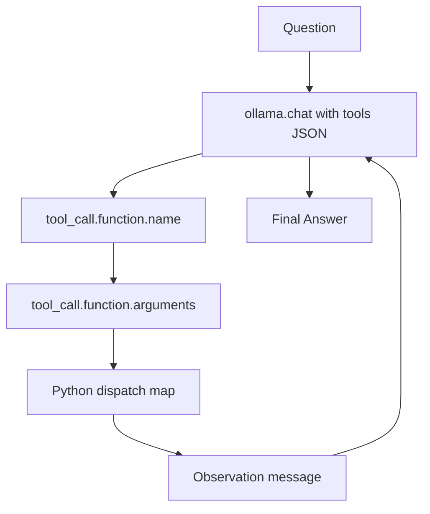
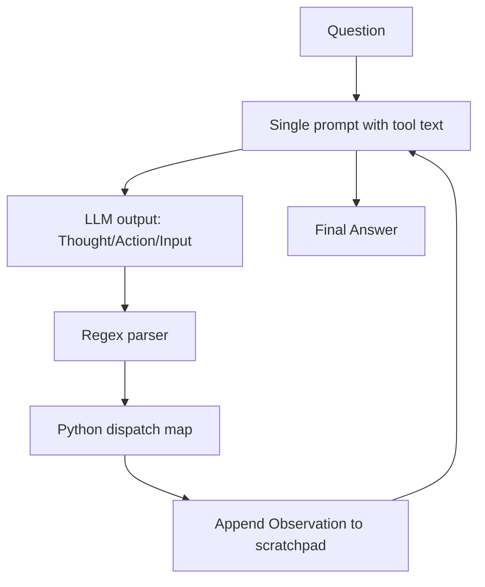

# Agents Under The Hood

This repository explains how **Reasoning and Acting (ReAct) Agents** work internally.
ReAct combines:

- **Reasoning**: The model thinks about what to do next.
- **Acting**: The model calls tools (search, calculator, code runner, APIs, etc.) to get missing information.

The agent repeats this pattern in loops until it has enough evidence to produce a final answer.

## What Is a ReAct Agent?

A ReAct agent is a control loop around an LLM:

1. Understand the user goal.
2. Think step-by-step (internal reasoning).
3. Decide whether to call a tool.
4. Observe the tool output.
5. Update the plan.
6. Repeat until ready to answer.

This improves reliability because the model does not guess when it can verify with tools.

## Architecture Diagram



## Diagram Explanation

- `User Request`: The problem statement from the user.
- `Orchestrator / Agent Runtime`: Controls the loop and decides when to continue or stop.
- `LLM Core`: Generates thoughts, actions, and responses.
- `Reasoning State`: Tracks current hypothesis, missing facts, and next step.
- `Need external info?`: Decision gate. If knowledge is missing, use tools.
- `Action Planner`: Chooses the best tool and input.
- `Tool Call`: Executes API/query/code/tool action.
- `Observation / Tool Result`: Captures returned data.
- `Memory + Context Update`: Adds trusted observations back into context.
- `Answer Composer`: Builds the final user-facing answer from verified info.
- `Validation / Safety Check`: Ensures quality, policy, and format correctness.

## ReAct Loops

### Loop1: Reasoning Loop (Think -> Decide)

Purpose: decide what is missing and whether action is required.

Typical steps:

1. Parse intent and constraints.
2. Generate a short plan.
3. Identify unknowns.
4. Decide: answer now or gather data.

Output of Loop1:

- Either a direct answer draft, or
- A structured action request for Loop2.

### Loop2: Acting Loop (Act -> Observe -> Update)

Purpose: resolve unknowns via tools.

Typical steps:

1. Select tool (`search`, `db`, `calculator`, `code`, etc.).
2. Execute with precise inputs.
3. Capture observation.
4. Evaluate if observation is enough.
5. If not enough, act again.
6. Send updated context back to Loop1.

Key idea: each action should reduce uncertainty.

### Answer Loop (Anwer Loop): Compose -> Verify -> Deliver

Purpose: produce the final response once confidence is high.

Typical steps:

1. Compose answer using verified observations.
2. Check correctness, clarity, and safety.
3. Ensure response matches user format/style needs.
4. Return final answer.

> Note: "Anwer loop" is commonly intended as "Answer loop".

## End-to-End Flow Summary

1. User asks a question.
2. **Loop1** reasons about what is needed.
3. If needed, **Loop2** gathers evidence using tools.
4. Agent cycles between Loop1 and Loop2 until ready.
5. **Answer loop** formats and validates the final response.

## Why ReAct Works Well

- Reduces hallucination by grounding answers in tool output.
- Improves traceability (you can inspect steps).
- Handles complex tasks through iterative decomposition.
- Supports dynamic planning when new information appears.

## Minimal Pseudocode

```text
state = init(user_query)

while not state.ready_to_answer:
	thought = reason(state)                  # Loop1
	if thought.requires_action:
		obs = act_and_observe(thought)       # Loop2
		state = update(state, obs)
	else:
		state.ready_to_answer = True

final_answer = compose_and_validate(state)   # Answer loop
return final_answer
```

## uv Quickstart Commands

`uv` is a fast Python package and project manager. Use it to initialize projects, manage dependencies, and run code.

### Project setup

```bash
# Initialize a new Python project in the current directory
uv init

# Initialize with a specific project name
uv init my_project
```

### Dependency management

```bash
# Add a runtime dependency
uv add requests

# Add multiple dependencies
uv add fastapi pydantic

# Add a development dependency
uv add --dev pytest ruff

# Remove a dependency
uv remove requests
```

### Run and execute

```bash
# Run a Python file using the project environment
uv run main.py

# Run a module
uv run -m pytest

# Run a command-line tool from dependencies
uv run ruff check .
```

### Environment and sync

```bash
# Create/update environment from lockfile
uv sync

# Rebuild lockfile from pyproject.toml
uv lock

# Show dependency tree
uv tree
```

### Python version management

```bash
# Pin a Python version for the project
uv python pin 3.12

# Install a Python version
uv python install 3.12
```

### Useful workflow

```bash
uv init
uv add openai
uv add --dev pytest
uv run python -c "print('ReAct agent project ready')"
```

## ReAct Prompt (Tools as Plain Text)

This version of the project does **not** pass tools through `ollama.chat(..., tools=...)`.
Instead, tools are injected into the prompt as plain text, and the model follows a strict ReAct output format.

The core idea:

1. Build a tool list from Python functions.
2. Put that tool list inside the prompt.
3. Ask the model to emit `Action:` and `Action Input:` lines.
4. Parse those lines with regex.
5. Execute the tool in Python.
6. Feed back `Observation:` into the scratchpad.
7. Repeat until `Final Answer:` appears.

### Tool Descriptions Are Generated from Functions

Tool metadata is created with `inspect`:

```python
def get_tool_descriptions(tools_dict):
    descriptions = []
    for tool_name, tool_function in tools_dict.items():
        original_function = getattr(tool_function, "__wrapped__", tool_function)
        signature = inspect.signature(original_function)
        docstring = inspect.getdoc(tool_function) or ""
        descriptions.append(f"{tool_name}{signature} - {docstring}")
    return "\n".join(descriptions)
```

This produces plain-text tool lines such as:

```text
get_product_price(product: str) -> float - Look up the price of a product in the catalog.
apply_discount(price: float, discount_tier: str) -> float - Apply a discount tier to a price and return the final price.
```

### ReAct Prompt Template

The model is guided with one large prompt string containing:

- Strict tool-use rules
- Tool descriptions
- Allowed action names
- Required ReAct format (`Thought`, `Action`, `Action Input`, `Observation`, `Final Answer`)

```text
Question: the input question you must answer
Thought: you should always think about what to do
Action: the action to take, should be one of [get_product_price, apply_discount]
Action Input: the input to the action, as comma separated values
Observation: the result of the action
... (repeat)
Thought: I now know the final answer
Final Answer: the final answer to the original input question
```

### Agent Loop in This Pattern

1. Create `full_prompt = prompt + scratchpad`.
2. Call `ollama.chat()` without the `tools` parameter.
3. Stop generation at `\nObservation` so Python controls the real observation.
4. Parse `Final Answer` first.
5. If missing, parse `Action` + `Action Input`.
6. Execute selected tool from a Python dictionary.
7. Append `Observation` to `scratchpad` and continue.

### Why This Is Useful

- Shows the raw mechanics of ReAct without framework abstraction.
- Makes every orchestration step explicit (prompting, parsing, dispatch, loop state).
- Great for learning and debugging agent behavior.

### Tradeoffs

- More fragile than native tool-calling because regex depends on strict model formatting.
- Requires careful prompt design and defensive parsing.
- Easier to inspect, harder to scale for many tools.

For this repository's educational goal, this plain-text ReAct approach is intentional and makes the "agent under the hood" behavior fully visible.

## LangChain Tool Abstraction vs Manual JSON Parsing vs ReAct Prompt

This section compares three common agent-tool integration styles.

| Aspect | LangChain Tool Abstraction | Manual JSON Tool Parsing | ReAct Prompt (Plain Text Tools) |
|---|---|---|---|
| Tool definition | `@tool` decorator + type hints/docstrings | Hand-written JSON schemas in `tools=[...]` | Plain-text tool descriptions embedded in prompt |
| LLM call style | `llm.bind_tools(...).invoke(...)` | `ollama.chat(..., tools=tools_for_llm, ...)` | `ollama.chat(..., messages=[prompt])` (no `tools=`) |
| Tool-call extraction | Framework object (`tool_calls`) | JSON tool-call objects from model response | Regex parse of `Action` and `Action Input` lines |
| Execution path | `tool.invoke(...)` via framework wrappers | Python dispatch table + parsed JSON args | Python dispatch table + parsed text args |
| Reliability | High (structured orchestration) | High-Medium (structured, but hand-rolled) | Medium-Low (format-sensitive prompt parsing) |
| Transparency for learning | Medium | High | Very high |
| Boilerplate | Low | Medium-High | Medium |
| Best use | Production speed + maintainability | Low-level control with native tool-calling | Teaching/demo of ReAct internals |

### Visual Comparison



### Diagram: LangChain Tool Abstraction



### Diagram: Manual JSON Tool Parsing



### Diagram: ReAct Prompt Parsing



### Quick Guidance

- Choose **LangChain abstraction** for robust production workflows and lower maintenance.
- Choose **manual JSON parsing** when you want native tool-calling with full control of schemas.
- Choose **ReAct prompt parsing** when your goal is to understand and teach the exact internal reasoning/acting loop.